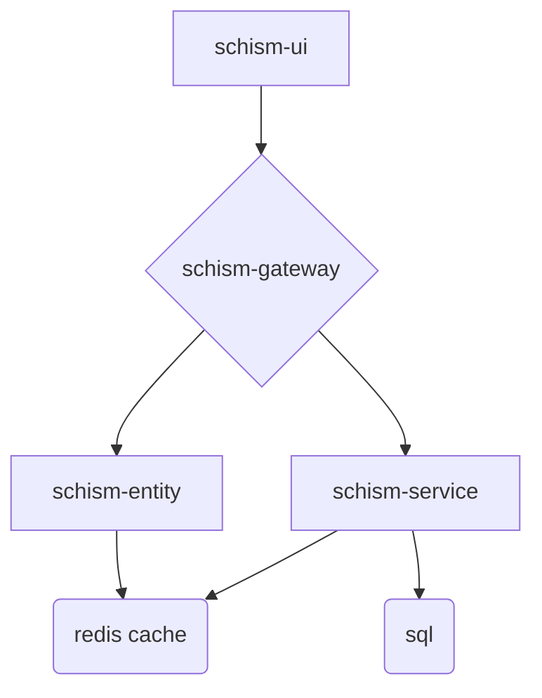

# Schism
Schism is a Persistent World, Real-Time Strategy game.

# Microservice Architecture Diagram

# Road-Map

## schism-entity tasks
- create permissions and permission groups -> lock down access to super-user mutations
- add range field to entity object

## Deployment Tasks
- Investigate Dockerfiles for each repo
- Create a kubenernetes cluster and service-level configurations for each repo

## Tech Debt
- Refactor name of schism-service to schism-world