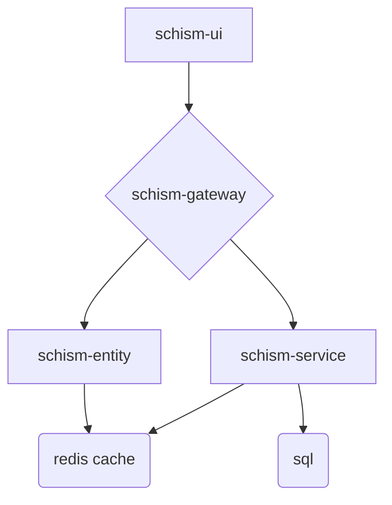
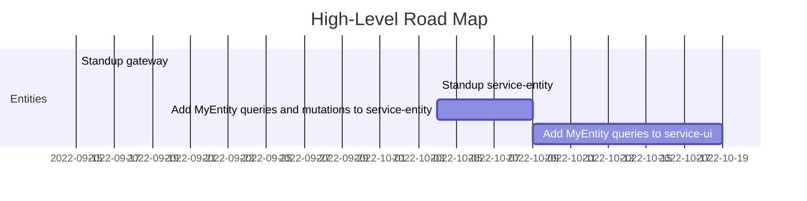

# Schism
Schism is a Persistent World, Real-Time Strategy game.

# Microservice Architecture Diagram

```mermaid
graph TD
    A[schism-ui] --> B{schism-gateway}
    B --> C[schism-service]
    B --> D[schism-entity]
    D --> E(redis cache)
    C --> E
    C --> F(sql)
```

# Road-Map
This roadmap depicts project goals at a high level.

```mermaid
gantt
dateFormat  YYY-MM-DD
title High-Level Road Map

section Entities
Standup gateway :done, des1, 2022-09-15, 2022-10-04
Standup service-entity :done, des2, 2022-10-04, 2022-10-08
Add MyEntity queries and mutations to service-entity : des3, after des2, 5d
Add MyEntity queries to service-ui : des4, after des3, 10d
```