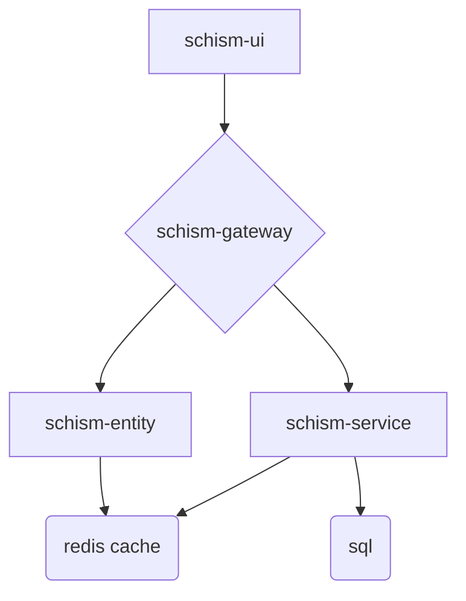

# Schism
Schism is a Persistent World, Real-Time Strategy game.

# Microservice Architecture Diagram


# Local Development Tips:
* Start the services in this order:
  1. schism-service and its redis cache
  1. schism-entity
  1. schism-gateway (compose the supergraph first, if necessary)
  1. schism-ui
* Login through schism-ui and grab the authorization token. It can be added to apollo sandbox as a Shared Header to provide authentication and identity.
* The federated graph is available on port 4000, and the subgraphs for schism-service and schism-entity are available on 4010 and 4011, respectively.
* Opening up a terminal for each repo:
```
set-title() {
    # Set the PS1 title escape sequence; see "Customizing the terminal window title" here: 
    # https://wiki.archlinux.org/index.php/Bash/Prompt_customization#Customizing_the_terminal_window_title
    TITLE="\[\e]2;$@\a\]" 
    PS1=${PS1_BAK}${TITLE}
}

if [[ -z "$PS1_BAK" ]]; then # If length of this str is zero (see `man test`)
    PS1_BAK=$PS1 
fi

if [[ -n "$TITLE_DEFAULT" ]]; then # If length of this is NONzero (see `man test`)
    set-title "$TITLE_DEFAULT"
fi

schism_tabs() {
    export PREP="git fetch --all && git status"
    cd /home/andrew/Development/schism/schism-ui
    git fetch --all && git status
    gnome-terminal --tab --working-directory=/home/andrew/Development/schism/schism-gateway -- bash -ic "export TITLE_DEFAULT='Schism Gateway'; $PREP; bash"
    gnome-terminal --tab --working-directory=/home/andrew/Development/schism/schism-service -- bash -ic "export TITLE_DEFAULT='Schism Service'; $PREP; bash"
    gnome-terminal --tab --working-directory=/home/andrew/Development/schism/schism-entity -- bash -ic "export TITLE_DEFAULT='Schism Entity'; $PREP; exec bash"
    gnome-terminal --tab --working-directory=/home/andrew/Development/schism/schism-assets -- bash -ic "export TITLE_DEFAULT='Schism Assets'; $PREP; exec bash"
    gnome-terminal --tab --working-directory=/home/andrew/Development/schism/schism-root -- bash -ic "export TITLE_DEFAULT='Schism Root'; $PREP; exec bash"
    set-title "Schism UI"
}
```

# New Repo Setup
```
npm i -D husky @commitlint/cli @commitlint/config-conventional @commitlint/cz-commitlint
npm pkg set scripts.prepare="husky install"
npm run prepare
commitizen init cz-conventional-changelog --save-dev --save-exact
```