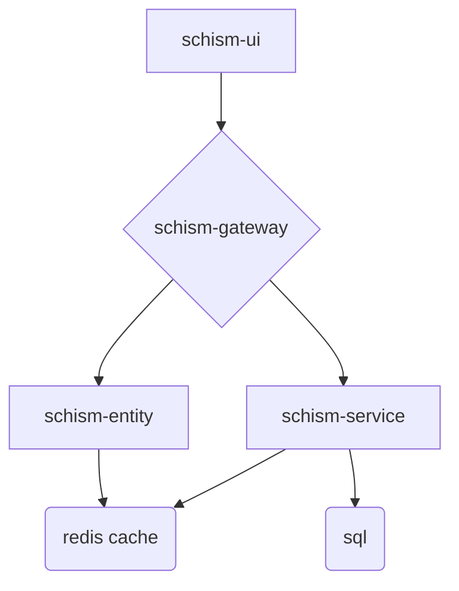
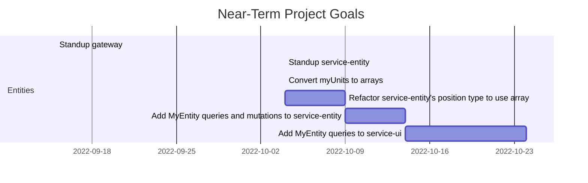

# Schism
Schism is a Persistent World, Real-Time Strategy game.

# Microservice Architecture Diagram

# Road-Map

### Schism-UI Tasks
- Fix dreadful css

### Schism-entity Tasks
- [done] Need a way to add fields/methods to entities received from the backend
- Change position type from object to array. This will allow service-ui to not need to convert them to arrays since the native ThreeJS library use array types.
- consider creating different EntityInput types for create and update mutations with different required fields. E.g., update might only require an id and ownerId (and one other field to do the update). This would make it impossible to arbitrarialy update field's on another player's entities. 
- Add mutations for:
  - Creating new units
  - Damaging another player's units
  - Performing unit actions
- need to decide whether and how to store, validate, and represent unit actions server-side. E.g., maybe all actions would initially run client-side while they're simultaneously being validated and disseminated to other clients
- create permissions and permission groups -> lock down access to super-user mutations
- add range field to entity object

### Deployment Tasks
- Investigate Dockerfiles for each repo
- Create a kubenernetes cluster and service-level configurations for each repo

### Other Tech Debt

# Local Development Tips:
* Start the services in this order:
  1. schism-service and its redis cache
  1. schism-entity
  1. schism-gateway (compose the supergraph first, if necessary)
  1. schism-ui
* Login through schism-ui and grab the authorization token. It can be added to apollo sandbox as a Shared Header to provide authentication and identity.
* The federated graph is available on port 4000, and the subgraphs for schism-service and schism-entity are available on 4010 and 4011, respectively.