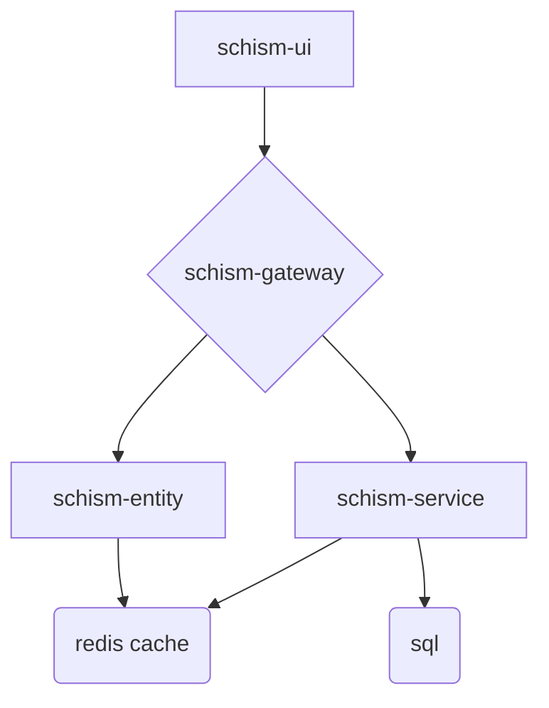

# Schism
Schism is a Persistent World, Real-Time Strategy game.

# Microservice Architecture Diagram

```mermaid
graph TD
    A[schism-ui] --> B{schism-gateway}
    B --> C[schism-service]
    B --> D[schism-entity]
    D --> E(redis cache)
    C --> E
    C --> F(sql)
```

# Road-Map
